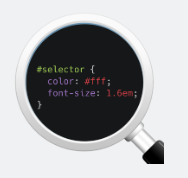
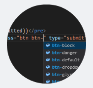
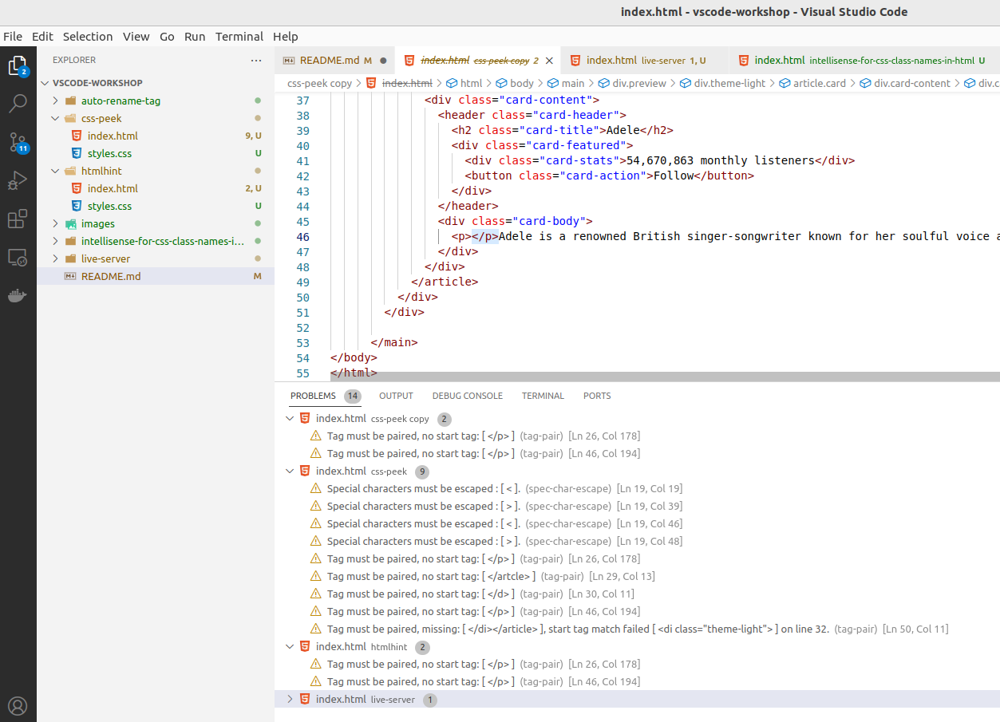
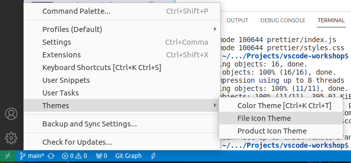
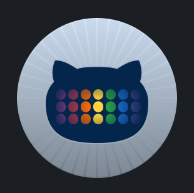
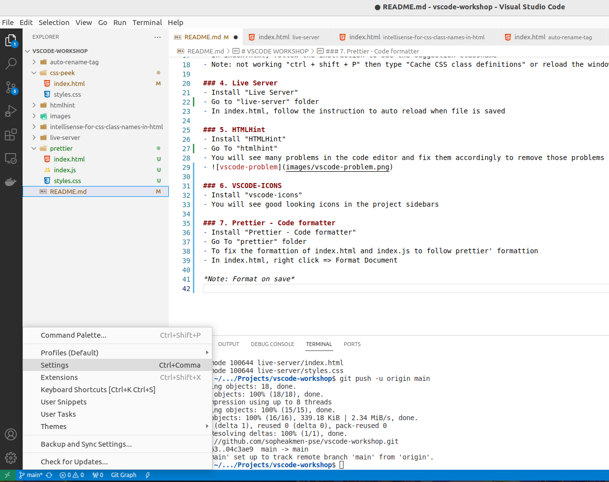
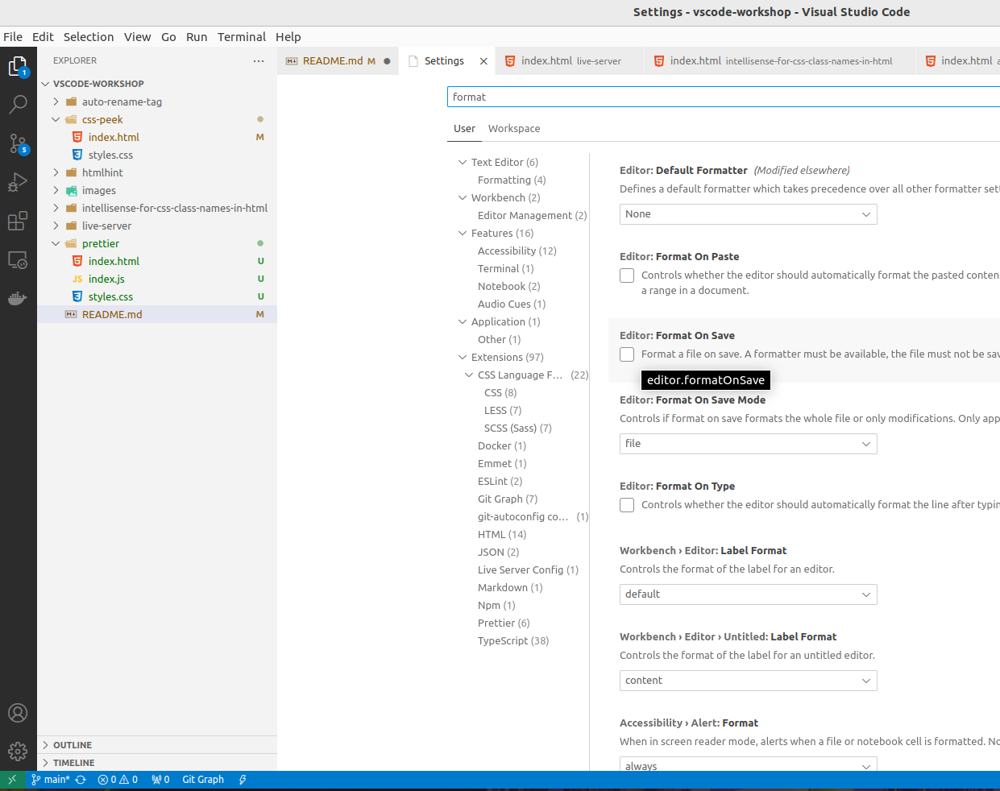
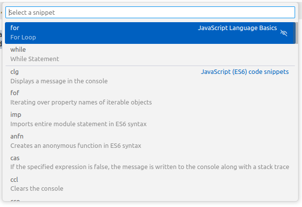

# VSCODE WORKSHOP

### 1. Auto Rename Tag

<figure>
        
</figure>

- Install "auto rename tag" [Install](https://marketplace.visualstudio.com/items?itemName=formulahendry.auto-rename-tag)
- Go to "auto-rename-tag" folder
- In index.html, rename each section that uses div tag to HTML5 tag ```<header>```, ```<section>```, ```<nav>```, ```<aside>```, and ```<footer>```


### 2. CSS Peek

<figure>

</figure> 

- Install "css peek" [Install](https://marketplace.visualstudio.com/items?itemName=pranaygp.vscode-css-peek)
- Reload vscode window
- Go to "css-peek" folder
- In index.html, hover on class and press "ctrl" to see the css class's properties


### 3. IntelliSense for CSS class names in HTML

<figure>

</figure>

- Install "IntelliSense for CSS class names in HTML" [Install](https://marketplace.visualstudio.com/items?itemName=Zignd.html-css-class-completion)
- Go to "intellisense-for-css-class-names-in-html" folder
- In index.html, follow the instruction to see the suggestion classname 
- Note: not working "ctrl + shift + P" then type "Cache CSS class definitions" or reload the window


### 4. Live Server

<figure>

</figure>

- Install "Live Server" [Install](https://marketplace.visualstudio.com/items?itemName=ritwickdey.LiveServer)
- Go to "live-server" folder
- In index.html, follow the instruction to auto reload when file is saved


### 5. HTMLHint

<figure>

</figure>

- Install "HTMLHint" [Install](https://marketplace.visualstudio.com/items?itemName=HTMLHint.vscode-htmlhint)
- Go To "htmlhint"
- You will see many problems in the code editor and fix them accordingly to remove those problems
- 


### 6. Prettier - Code formatter

<figure>

</figure>

- Install "Prettier - Code formatter" [Install](https://marketplace.visualstudio.com/items?itemName=esbenp.prettier-vscode)
- Go To "prettier" folder
- To fix the formattion of index.html and index.js to follow prettier' formattion
- In index.html, right click => Format Document


### 7. VSCODE-ICONS

<figure>

</figure>

- Install "vscode-icons" [Install](https://marketplace.visualstudio.com/items?itemName=vscode-icons-team.vscode-icons)
- You will see good looking icons in the project sidebars
- To change icon theme => File Icon Theme



### 8. GitHub Theme

<figure>

</figure>

- Install "GitHub Theme" [Install](https://marketplace.visualstudio.com/items?itemName=GitHub.github-vscode-theme)
- To change color theme => Color Theme


**Note: Format on save**

1. Go to settings

2. Type "format" on search box and check "Format on Save"


## Emmet Tools

- [Cheatsheet](https://quickref.me/emmet.html)
- Go to "emmet" folder 
- In index.html, test emmets from the cheatsheet

## Snippet Tools

- Go to "snippet" folder to test on snippet as following
  - Open command palette: Shift + Command + P (Mac) / Ctrl + Shift + P (Windows/Linux)
  - Type “snippet”
  - In the options list
  - Choose “Snippets: Insert Snippet”
  - Select a snippet (Eg. for, clg, imp, etc…)
    
